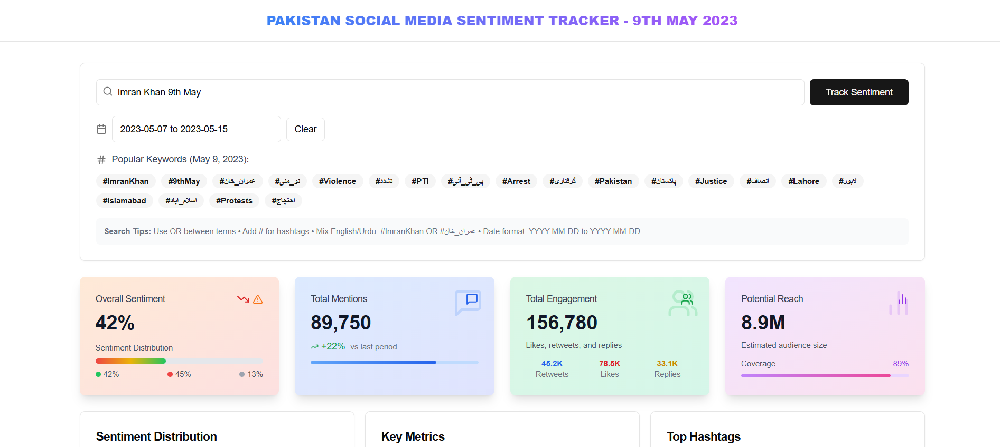

# Pakistan Social Media Sentiment Tracker - 9th May 2023

A web application to track and analyze social media sentiment around trending topics and events in Pakistan, with a focus on the events of 9th May 2023.

---

## Features

- **Keyword & Hashtag Tracking:** Search and filter by keywords, hashtags, and date ranges.
- **Sentiment Analysis:** Visualize overall sentiment (positive, negative, neutral) for selected topics.
- **Popular Keywords:** View trending hashtags and keywords in both English and Urdu.
- **Key Metrics:** 
    - Total Mentions
    - Total Engagement (likes, retweets, replies)
    - Potential Reach (estimated audience size)
- **Sentiment Distribution:** Breakdown of sentiment percentages.
- **Search Tips:** Advanced search using OR, hashtags, and mixed language queries.

---

## Screenshot


---

## Getting Started

### Prerequisites

- Node.js (v14+)
- npm or yarn

### Installation

```bash
git clone https://github.com/zulfiqar-ali01/sentimentTracker.git
cd sentimentTracker
npm install
```

### Running Locally

```bash
npm start
```

The app will be available at `http://localhost:3000`.

---

## Usage

1. Enter a keyword or hashtag in the search bar (e.g., `Imran Khan 9th May`).
2. Select a date range.
3. Click **Track Sentiment** to view analytics.
4. Explore sentiment distribution, engagement metrics, and trending hashtags.

---

## Technologies Used

- React.js (Frontend)
- Node.js/Express (Backend)
- Sentiment Analysis API (custom or third-party)
- Chart.js or similar for data visualization

---

## Folder Structure

```
/src
    /components
    /api
    /assets
    App.js
    index.js
/README.md
```

---

## Contributing

Contributions are welcome! Please open issues or submit pull requests for improvements.

---

## License

This project is licensed under the MIT License.

---

## Contact

For questions or feedback, please contact [your.email@example.com](mailto:your.email@example.com).
